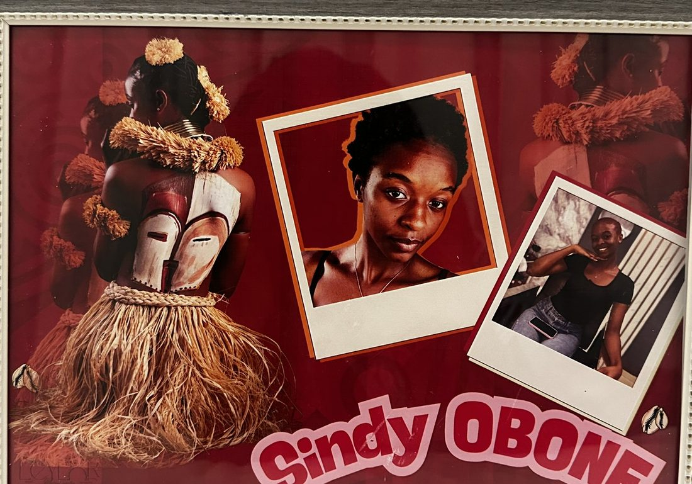

# LEYLOR

Proposition de refonte du site de **LEYLOR** — maison créative à Libreville :
albums, magazines, livrets de couple et cadres composés à la main, photo par
photo, **sur le thème de la personne à qui on l'offre**.

Site existant : https://leylor.vercel.app

## Le parti pris : l'atelier de découpage

Le site actuel est propre, mais chaque choix y est le choix par défaut, et les
quatre sections sont bâties sur le même gabarit — label, titre, paragraphe à
droite. C'est cette répétition qui fait « généré », pas les couleurs.

Ici tout est papier. Le fond a du grain et de la fibre. **Les sections ne se
succèdent pas par des lignes droites mais par des déchirures**, tracées au
chargement par une marche aléatoire — aucune n'est identique à une autre, ni
d'une visite à l'autre. Les photos sont des tirages découpés, à bord blanc,
tenus par du ruban adhésif et jamais tout à fait droits. Et le catalogue n'est
plus une grille de cartes : **c'est un album qu'on feuillette**, page après
page, chacune imposant sa couleur au fond.

| | Avant | Ici |
|---|---|---|
| Chargement | animation Lottie de chariot (CDN) | le logotype de la marque, chaque lettre dans une technique différente : tracée, découpée, patchwork, tamponnée, pivotée, déboîtée |
| Logotype | — | **le sien**, repris tel quel — c'est sa marque, elle doit rester reconnaissable |
| Hero | moitié sombre / moitié photo | plein cadre, traînée de tirages au mouvement de la souris, curseur-perle qui éclaire le fond |
| Créations | grille de six cartes, ouverte sur deux produits indisponibles | album feuilleté, une création par page, patchwork de tirages collés — les deux à venir ferment la marche |
| Thèmes | absents | une page de carnet : dix cartons découpés et scotchés, en noir et blanc. Au survol, le carton retrouve sa couleur et la page se couvre de griffonnages au feutre dans cette même couleur — et le thème choisi part dans le message WhatsApp |
| Transitions | bords droits | déchirures de papier, tracées à chaque chargement |
| Texte | statique | titres découpés mot à mot, chaque mot retombe en place de travers avant de se ranger |
| Dégradés | fonds plats | **dans le texte** : texture en soft-light sur un dégradé qui s'évanouit vers le bas |

Ce qui est **gardé** : la palette bordeaux et crème, et surtout le bon de
commande qui se lit comme une lettre et se conclut sur WhatsApp — pas de panier,
pas de paiement en ligne. C'est la bonne contrainte pour le Gabon et c'est la
meilleure idée du site d'origine.

## Parti pris technique

Aucune dépendance. Pas de framework, pas de bundler, pas de GSAP, pas de Lenis.
Trois fichiers, tout écrit à la main :

```
index.html            page autonome
css/leylor.css        feuille de style unique
js/leylor.js          interactions
logotype-source.svg   les six lettres d'origine, pour référence
```

Le numéro WhatsApp se change à la ligne 14 de `js/leylor.js`.

## Ce qui est fait maison

- **Le logotype** — ses six lettres sont définies une seule fois dans un `<defs>`
  et rappelées par `<use>` partout : barre de navigation, chargement, pied. Les
  25 Ko de tracés ne sont jamais recopiés.
- **Chargement** — chaque lettre arrive dans sa propre technique. La première
  part dès le premier pas : attendre un sixième du chargement pour montrer quoi
  que ce soit, c'est ouvrir sur un écran vide. Piloté par `setInterval` et non
  par `requestAnimationFrame` : rAF ne se déclenche pas dans un onglet masqué, ce
  qui bloquerait la page sur l'écran de chargement. Chien de garde à 7 s.
- **Déchirures** — marche aléatoire bornée : on avance par pas irréguliers et la
  hauteur dérive, sans jamais sortir de la feuille. Redessinées au
  redimensionnement.
- **Dégradé dans le texte** — `background-clip: text`, une texture tuilée en
  `soft-light` par-dessus un dégradé vertical qui s'évanouit. Technique relevée
  sur jjettas.com, transposée à la palette de la marque.
- **Traînée de tirages** — douze vignettes vivent en permanence dans le DOM et
  sont reposées sous le curseur à tour de rôle ; rien n'est créé ni détruit
  pendant le mouvement. Seuil de 118 px, sinon un micro-tremblement en poserait
  trente. L'adoucissement est porté par chaque image-clé et non par les options
  de l'animation — une courbe passée en option s'applique à l'itération entière
  et déplace tous les repères.
- **Curseur-perle** — la perle suit la souris avec un peu de retard, la lueur
  avec beaucoup. C'est l'écart entre les deux qui donne une matière.
- **L'album** — la position dans la piste devient un curseur `f` : sa partie
  entière désigne la page du dessus, chaque fond se dévoile d'autant plus que `f`
  est proche de son indice. La page se lève jusqu'au profil puis s'efface tôt —
  au-delà on verrait son dos, et une page menée à 180° viendrait se coucher sur
  la colonne de texte. Les pages déjà tournées ou enfouies sont retirées du
  rendu.
- **Le mur de thèmes** — chaque carton porte un fragment de son travail posé en
  `mix-blend-mode: luminosity` : la matière ne fournit que les valeurs, la teinte
  vient du fond de la carte. Il suffit donc de désaturer la face pour éteindre
  toute la planche, et de rendre la saturation au survol pour que la couleur
  revienne — sans jamais dupliquer une image en noir et blanc, ni charger deux
  fois le même fichier. Sur un écran sans survol, la couleur est rendue d'office.
- **Les griffonnages** — dix-huit dessins au feutre tirés en quelques traits,
  définis une fois et rappelés par `<use>` : soixante marques réparties sur dix
  thèmes. Au survol, le groupe s'allume dans la couleur de son thème et chaque
  trait se dessine. Masqués sur écran tactile : sans survol, ils n'ont personne
  à suivre.
- **La route de l'atelier** — le tracé de fond est la route prévue, en pointillé
  comme sur une carte ; l'encre est le chemin déjà parcouru, et **un avion en
  papier vole au bout**. `pathLength="1"` normalise la longueur du tracé encré,
  mais la position de l'avion est mesurée sur le tracé de fond, lui sans
  `pathLength` : aucune ambiguïté sur ce que `getTotalLength` renvoie. L'avion
  est posé hors du SVG, qui est étiré sans conserver ses proportions et le
  déformerait, et son angle est calculé dans l'espace de l'écran — sinon il
  pointerait à côté de sa route.
- **Bon de commande** — la finition disparaît quand elle n'a pas lieu d'être, le
  thème part dans le message WhatsApp, le total se recalcule, les deux créations
  à venir restent visibles mais verrouillées.
- **Accessibilité** — `prefers-reduced-motion` neutralise tout et déroule l'album
  au lieu de le feuilleter, focus visible partout, contenu lisible sans
  JavaScript.

## Les photos

Le site tourne sur **ses propres pièces**, pas sur des images trouvées en ligne.
Trois photos de son site d'origine ont servi de matière :

| Source | Ce que c'est |
|---|---|
| `IMG_2924` | Le tableau **ERWYN**, remis à son destinataire un soir à Libreville |
| `IMG_2927` | Le collage encadré **LEILA** (4032×3024) |
| `IMG_2928` | Le collage encadré **Sindy OBONE** (4032×3024) |

Les deux collages avaient été photographiés **à l'envers** : ils sont redressés.
Leurs 12 Mpx ont ensuite été découpés en détails — un masque, des lettres de
magazine, un lys, des cauris, un polaroid — ce qui donne **20 images** à partir
de trois photos. Tout est recadré à la taille réellement affichée : 1,7 Mo pour
l'ensemble du site.

Les quatre autres images du site d'origine n'ont **pas** été reprises : ce sont
des mises en scène produit trouvées en ligne (noms de fichiers en empreinte,
735 px, couple de banque d'images devant un sapin). Elles ne montrent pas son
travail, et c'est une des raisons pour lesquelles son site actuel paraît
générique.

### Les compositions d'atelier

Photobook et Magazine n'ont aucune photo existante — ces créations sont encore
annoncées « bientôt ». Plutôt que d'emprunter la production de quelqu'un
d'autre, **huit collages ont été composés à partir de ses propres fragments**
(`img/c01`–`c08`) : ses portraits, ses lettres de magazine, son masque, ses
fleurs, remontés sur des fonds colorés avec grain et ombres portées.

Ce sont donc des visages afro et du collage artistique — les siens. Le script
qui les assemble monte chaque fragment en tirage à marge blanche, le pivote et
le pose avec son ombre ; il est reproductible dès qu'elle fournira d'autres
pièces. Leur texte alternatif dit « composition d'atelier », pas « page
d'album » : ce sont des illustrations d'ambiance, pas des photos de produits
existants.

Les quatre images du site d'origine qui venaient du net n'ont **pas** été
reprises : mises en scène produit, couple de banque d'images, 735 px. Elles ne
montrent pas son travail.

### Ce qui reste à photographier

Quatre créations sont aujourd'hui illustrées par des **détails de collages**
plutôt que par le format annoncé. Dès qu'elle peut :

1. un **cadre A4 classique** posé sur un meuble — une seule photo encadrée ;
2. un **tirage plexiglass**, de trois quarts pour qu'on voie la lumière passer ;
3. un **livret de couple ouvert**, à plat ;
4. un **tableau A3 accroché au mur**, à distance, dans une pièce.

Pour brancher une nouvelle image, remplacer la balise — le cadrage est porté par
le parent, il n'y a rien d'autre à changer :

```html
<figure class="pr a"></figure>
```

## Mise en ligne

Le site est du statique pur : aucune construction, aucune dépendance à
installer. N'importe quel hébergeur le sert tel quel.

- **GitHub Pages** (actuel) : https://firstged.github.io/leylor/ — branche `main`,
  racine.
- **Vercel** : importer le dépôt, préréglage **« Other »**, aucune commande de
  construction, répertoire de sortie à la racine. Le `vercel.json` ne fait que
  poser des en-têtes de cache d'une semaine sur `img/`, `css/` et `js/`. Une
  semaine et non un an : les photos seront remplacées au fur et à mesure qu'elle
  en fournira, et un cache d'un an les figerait chez les visiteurs.

### Si LEYLOR reprend le site

C'est sa marque : le dépôt devrait finir chez elle, pas chez moi.

1. **Transférer le dépôt** vers son compte GitHub (`Settings` → `Danger Zone` →
   `Transfer ownership`), ou le forker si elle préfère repartir d'une copie.
2. Dans son projet Vercel existant : `Settings` → `Git` → déconnecter la source
   actuelle, puis connecter le dépôt transféré. **Le projet et l'adresse
   `leylor.vercel.app` sont conservés** — seule la source change.
3. Chacun s'invite chez l'autre par les mécanismes prévus (collaborateur GitHub,
   membre d'équipe Vercel). **Jamais d'échange de mots de passe.**

Son numéro WhatsApp se change à la ligne 14 de `js/leylor.js`.

## Développement

Ouvrir `index.html` dans un navigateur. Rien à installer.

`build-artifact.py` dérive une variante sans balises englobantes pour l'aperçu
Claude — inutile au déploiement.

## Crédits

Logotype, créations et photographies : LEYLOR, Libreville.
Refonte et code : [Gfirst](https://github.com/firstged)
